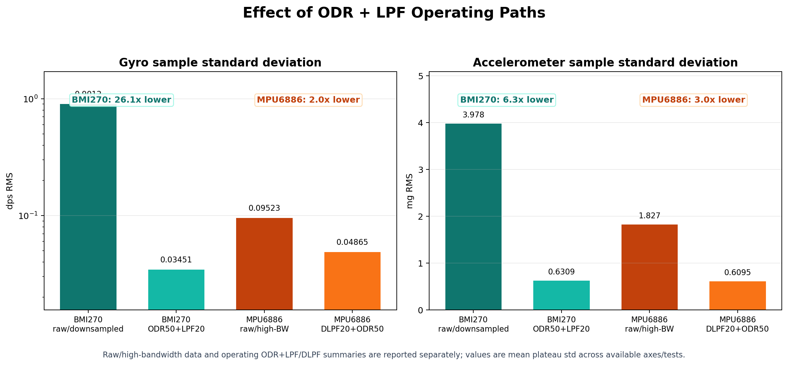
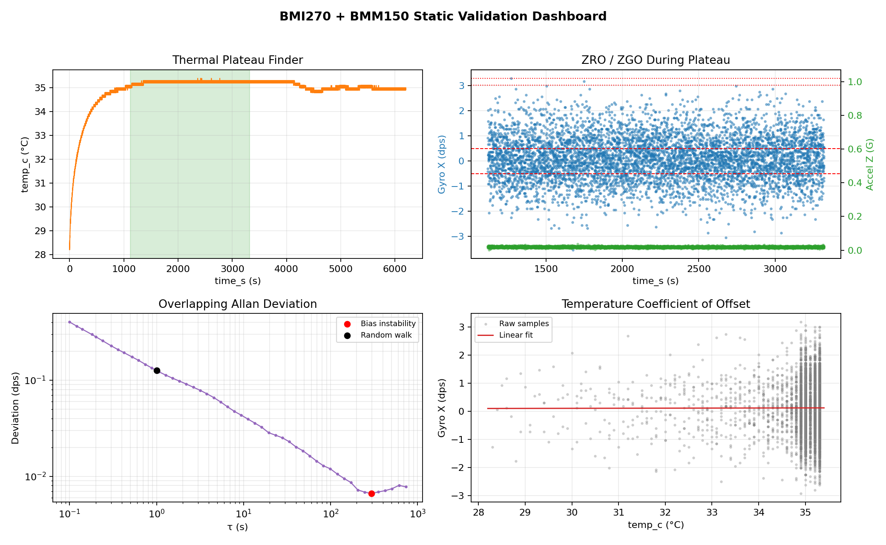
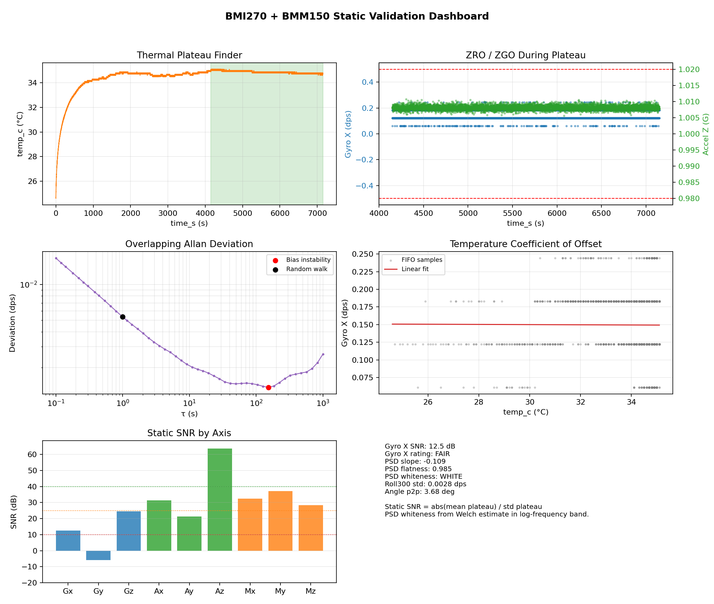

# AtomS3 vs AtomS3R Sensor Bench Whitepaper

Living update: 2026-04-30

## 0. Delivery Abstract

This whitepaper summarizes a static sensor-bench comparison between one
M5Stack AtomS3 unit using MPU6886 and one M5Stack AtomS3R unit using
BMI270 + BMM150. The goal is not a population-level MEMS qualification or a
generic winner/loser review; it is an engineering evidence package for
selecting the safer IMU operating path for the current vehicle ESKF pipeline.

The current evidence favors AtomS3R/BMI270 for this pipeline. The main BMI270
sensor behavior is characterized by the longer ODR50/LPF static plateau logs,
while `tel_148` is used as the clean firmware/logging confirmation: after the
current LPF/ZARU path it gives about 0.0068 / 0.0058 / 0.0061 dps final gyro
std with zero sequence gaps and zero estimated drops. MPU6886 remains
competitive in some static noise and Z-axis metrics, especially after DLPF20,
but the tested AtomS3 unit shows large and non-repeatable X/Y gyro startup
bias. A fixed DLPF20 +Z bias from `MPU6886_014` applied to the same-face repeat
`MPU6886_017` leaves +1.293 / +1.829 dps residual X/Y bias, which makes
per-boot/runtime bias estimation mandatory for any serious MPU6886 path.

The conclusion is therefore scoped and practical: for this specific
vehicle-telemetry and ESKF-input use case, AtomS3R/BMI270 provided the cleaner
and more practical operating path. The report does not claim that every MPU6886
unit is categorically worse than every BMI270 unit.

## 1. Executive Summary

This document is now a living technical comparison between the legacy M5Stack
AtomS3 / MPU6886 platform and the AtomS3R / BMI270 + BMM150 platform.

The original version of this whitepaper was based on an early M5Unified bench
run. That run was useful for platform bring-up, but it is no longer the right
basis for a final IMU verdict. The current study uses lower-level static logs:

- AtomS3R/BMI270: Bosch-direct physical IMU columns from static orientation
  tests, including the current 50 Hz FIFO post-LPF acquisition path.
- AtomS3/MPU6886: a new dedicated static bench firmware that logs only MPU6886
  FIFO data to SD, with fixed 256-byte records, CRC16, sequence numbers, and
  explicit timing/FIFO/SD diagnostics.

Current provisional conclusion: AtomS3R with BMI270 remains the preferred IMU
platform for the current ESKF pipeline. The BMI270 has substantially lower
gyro noise in the current operating path, lower accel noise, and a much smaller
raw gyro bias envelope than the current MPU6886 FIFO bench set. The MPU6886
still shows one important strength: its Z-axis drift can be very stable when
the board is static, consistent with the older MPU6886 bias-drift report.

The raw/high-bandwidth MPU6886 six-face set is now complete. It confirms the
historical concern: large X/Y gyro bias remains present even with a clean
logger, and X/Y drift is orientation/run dependent. The production-path
comparison now also has a three-orientation MPU6886 DLPF20/50 Hz set matching
the BMI270 ODR50/LPF20 axes tested so far. A DLPF20 same-face repeat confirms
that the MPU6886 X/Y startup bias is not repeatable after power-cycle even in
the filtered operating path.

| Category | Current Evidence | AtomS3 / MPU6886 | AtomS3R / BMI270 | Current Read |
| --- | --- | ---: | ---: | --- |
| Platform features | Hardware capability | MPU6886 only | BMI270 + BMM150 + PSRAM | AtomS3R is the stronger platform. |
| Logger integrity | Long static log validation | Clean in new bench firmware | Sensor FIFO clean; new SD write architecture passes timing in `tel_148` with zero sequence gaps and zero estimated drops. | AtomS3R logging issue appears resolved in the v1.8.2 confirmation run. |
| Gyro noise | Plateau std, dps | Raw six-face: about 0.121 / 0.104 / 0.060. DLPF20 three-axis: about 0.068 / 0.047 / 0.031. | About 0.0345 / 0.0355 / 0.0335 average over ODR50 tests | BMI270 remains quieter on X/Y operating path; MPU6886 Z is slightly quieter after DLPF. |
| Accel noise | Plateau std | Raw six-face: about 1.83 / 1.66 / 1.99 mg. DLPF20 three-axis: about 0.613 / 0.587 / 0.629 mg. | About 0.555 / 0.653 / 0.684 mg in ODR50 tests | Operating-path accel noise is comparable. |
| Gyro bias offset | Plateau mean, dps | Raw six-face: X -5.09..-2.52, Y -3.22..-1.55, Z -0.79..-0.41. DLPF20 three-axis mean: -3.75 / -2.65 / -0.66. Same-face DLPF20 +Z repeat shifted X/Y by +1.29 / +1.83 dps. | About +0.17 / +0.03 / +0.56 average over ODR50 tests. Same-face +Z repeat shifted X/Y/Z by +0.061 / -0.026 / -0.067 dps. | MPU6886 has much larger and less repeatable X/Y offsets. |
| Gyro drift at stable temp | Plateau slope, dps/h | X -0.101..+0.198, Y -0.041..+0.269, Z -0.019..+0.013 across six faces | X/Y within a few hundredths dps/h in ODR50 tests; Z about +0.02 to +0.05 dps/h | BMI270 better on X/Y envelope; MPU6886 Z remains very stable. |
| Bias correction behavior | Runtime pipeline / replay | Fixed MPU6886 DLPF20 +Z calibration 014->017 leaves +1.293 / +1.829 / +0.001 dps residual bias; per-run replay recenters but requires a runtime estimator. | `tel_148` measured firmware output: ZARU active 99.44%; final gyro std 0.0068 / 0.0058 / 0.0061 dps | BMI270 path is operationally well behaved after ZARU; MPU6886 is recoverable only with mandatory per-boot/runtime bias estimation. |

Important bandwidth policy: the final comparison must keep two tracks separate.

1. Raw/high-bandwidth vs raw/high-bandwidth: this compares the MEMS devices
   before the operating LPF path. The current MPU6886 FIFO bench belongs to this
   track. The earlier BMI270 raw/downsampled static set also belongs here.
2. Operating-LPF vs operating-LPF: this compares the signal actually intended
   for the ESKF input. The current BMI270 ODR50/LPF20 tests belong to this
   track. The matching MPU6886 DLPF20/50 Hz bench now covers the same three
   principal orientations tested for BMI270: +Z, +X, and -Y.

Until both tracks are complete, claims must state which bandwidth path they
refer to. The raw/high-bandwidth track is now summarized side by side, while
the operating-LPF track is now summarized for the three matched principal
orientations collected so far.

## 2. Current Artifacts

| ID | Artifact | Role |
| --- | --- | --- |
| B1 | `reports/bmi270/bmi270_odr50_lpf20_static_summary.md` | Current BMI270 ODR50 / LPF20 static summary. |
| B2 | `tools/script/bias-reports/static-orientations-odr50/orientamenti_statici_odr50_summary.csv` | Machine-readable BMI270 ODR50 summary. |
| B3 | `tools/script/bias-reports/tel_116_bosch_static_report.json` | BMI270 ODR50, gravity on +X (`usb-c-up`). |
| B4 | `tools/script/bias-reports/tel_117_bosch_static_report.json` | BMI270 ODR50, gravity on +Z (`su`). |
| B5 | `tools/script/bias-reports/tel_118_bosch_static_report.json` | BMI270 ODR50, gravity on -Y (`destra`). |
| B6 | `tools/script/bias-reports/tel_123_bosch_static_report.json` | BMI270 ODR50, gravity on +Z, repeat of `tel_117` after sync/logging changes. |
| B7 | `tools/script/bias-reports/tel_123_vs_tel_117_bmi_repeat_sync.md` | BMI270 +Z same-face repeatability and sync/logging comparison. |
| B8 | `tools/script/bias-reports/tel_148_bosch_static_report.json` | BMI270 ODR50, gravity on +Z, v1.8.2 SD write architecture confirmation run. |
| B9 | `tools/script/bias-reports/tel_148_sync_final_check.md` | Final sync/logging confirmation: zero timestamp gaps, zero sequence gaps, zero estimated drops. |
| B10 | `tools/script/bias-reports/tel_148_bmi_clean_validation_summary.md` | Clean-log validation summary confirming BMI270 noise, bias, PSD, accel, and ZARU conclusions without the earlier logging-gap caveat. |
| M1 | `tools/script/bias-reports/MPU6886_001.BIN` | Long MPU6886 FIFO bench run, gravity +Z. |
| M2 | `tools/script/bias-reports/MPU6886_002.BIN` | Long MPU6886 FIFO bench run, gravity -X. |
| M3 | `tools/script/bias-reports/MPU6886_003.BIN` | Long MPU6886 FIFO bench run, gravity +X. |
| M4 | `tools/script/bias-reports/MPU6886_static_long_summary.md` | Combined MPU6886 long-run plateau/noise/drift summary. |
| M5 | `tools/script/bias-reports/MPU6886_static_long_summary.csv` | Machine-readable MPU6886 long-run summary. |
| M6 | `tools/script/bias-reports/MPU6886_007.BIN` | Long MPU6886 FIFO bench run, gravity -Z. |
| M7 | `tools/script/bias-reports/MPU6886_010.BIN` | Long MPU6886 FIFO bench run, gravity -Y. |
| M8 | `tools/script/bias-reports/MPU6886_011.BIN` | Long MPU6886 FIFO bench run, gravity +Y. |
| M9 | `tools/script/bias-reports/MPU6886_static_sixface_aggregate.json` | Aggregate six-face MPU6886 raw/high-bandwidth characterization. |
| M10 | `tools/script/bias-reports/MPU6886_repeat_plusZ_comparison.md` | Same-face +Z repeatability check using `MPU6886_001`, `012`, and `013`. |
| M11 | `tools/script/bias-reports/raw_bmi_vs_mpu6886_comparison.md` | Raw/high-bandwidth BMI270 vs MPU6886 comparison, including PSD whiteness. |
| M12 | `tools/script/bias-reports/MPU6886_014.BIN` | MPU6886 operating-LPF run: ODR50, gyro DLPF_CFG=4, accel A_DLPF_CFG=4, gravity +Z. |
| M13 | `tools/script/bias-reports/MPU6886_015.BIN` | MPU6886 operating-LPF run: ODR50, gyro DLPF_CFG=4, accel A_DLPF_CFG=4, gravity +X. |
| M14 | `tools/script/bias-reports/MPU6886_016.BIN` | MPU6886 operating-LPF run: ODR50, gyro DLPF_CFG=4, accel A_DLPF_CFG=4, gravity -Y. |
| M15 | `tools/script/bias-reports/MPU6886_dlpf20_operating_summary.md` | Three-orientation MPU6886 DLPF20/ODR50 plateau/noise/PSD summary. |
| M16 | `tools/script/bias-reports/MPU6886_017.BIN` | MPU6886 operating-LPF same-face repeat run, gravity +Z. |
| M17 | `tools/script/bias-reports/MPU6886_014_vs_017_dlpf20_repeat.md` | DLPF20 +Z same-face repeatability check showing X/Y startup bias shift. |
| R1 | `tools/script/bias-reports/eskf_input_quality_comparison.md` | Runtime/ESKF input quality comparison: BMI270 measured firmware output versus MPU6886 static sensor-only replay. |
| R2 | `tools/script/bias-reports/eskf_input_quality_comparison.csv` | Machine-readable runtime/ESKF input quality table. |
| R3 | `tools/script/bias-reports/mpu6886_zaru_replay_summary.md` | MPU6886 fixed-bias, boot-window, and oracle plateau bias replay summary. |
| F7 | `reports/figures/figure_07_odr_lpf_improvement.png` | Visual summary of raw/high-bandwidth versus operating ODR+LPF/DLPF noise reduction. |
| H1 | `analysis/reports/MPU6886_BiasDrift_Report.pdf` | Historical MPU6886 six-face sequential bias drift study. |

The older M5Unified bench artifacts and figures are now treated as historical
bring-up evidence, not as the primary quantitative comparison.

## 2.1 Scope And Delivery Caveats

This package should be read with the following scope:

- The result characterizes the specific AtomS3 and AtomS3R units tested.
- It is strong enough for the current project decision because the tested
  firmware paths, bandwidths, and static correction strategy match the intended
  ESKF input path.
- It is not a manufacturing population study and does not estimate lot-to-lot
  variation.
- Static bench evidence is intentionally separated from dynamic vehicle
  performance. Dynamic replay remains the correct next step only if MPU6886
  runtime bias recovery needs to be evaluated further.
- Magnetometer behavior is kept outside the IMU verdict because BMM150 static
  readings depend strongly on the local magnetic environment.

## 3. Why The Original Whitepaper Needed Revision

The original report concluded that AtomS3 could appear quieter than AtomS3R
after warm-up. That observation was true for that specific old bench path, but
it is no longer a valid general IMU conclusion.

The older test had several limitations:

- It used a high-level M5Unified path rather than the current direct driver
  acquisition paths.
- It mixed platform, library, CSV streaming, thermal transient, and sensor
  behavior in the same result.
- It did not use the current BMI270 FIFO post-LPF path.
- It did not use the new MPU6886 FIFO-only bench logger.
- It was a single matched run per device, useful for bring-up but weak for a
  final sensor comparison.

The current static logs are more relevant because they expose the actual
physical IMU channels used for characterization and include much stronger
logging diagnostics.

## 4. Test Families And Comparability

The study now uses a two-track comparison model:

| Track | Purpose | AtomS3 / MPU6886 Evidence | AtomS3R / BMI270 Evidence | Status |
| --- | --- | --- | --- | --- |
| Raw/high-bandwidth | Compare MEMS behavior with minimal practical filtering before the operating LPF path. | New MPU6886 FIFO bench, 1 kHz source decimated to 50 Hz; six-face set complete. | Earlier BMI270 raw/downsampled FIFO static tests (`tel_83`, `tel_89`, `tel_94`, `tel_95`, `tel_96`, `tel_105`, `tel_106`, `tel_111`, `tel_115`). | Side-by-side raw comparison added. |
| Operating LPF | Compare the actual practical ESKF input path. | MPU6886 DLPF20/50 Hz tests (`MPU6886_014`, `015`, `016`) covering +Z, +X, -Y. | BMI270 ODR50/LPF20 static tests (`tel_116`, `tel_117`, `tel_118`) covering +X, +Z, -Y. | Three-axis side-by-side operating comparison added. |

This separation matters because decimation alone does not suppress white noise
the same way a hardware LPF does. A raw/high-bandwidth signal decimated to
50 Hz will normally show more sample-to-sample noise than a signal bandwidth
limited to about 20 Hz before sampling.

The measured before/after effect is substantial on both sensors:



| Sensor | Raw / High-Bandwidth Track | Operating ODR+LPF Track | Gyro Std Change | Accel Std Change |
| --- | --- | --- | ---: | ---: |
| BMI270 | Raw/downsampled static logs | ODR50 + LPF20/22 | `0.9012 -> 0.0345 dps`, about **26.1x lower** | `3.98 -> 0.631 mg`, about **6.3x lower** |
| MPU6886 | Raw/high-bandwidth FIFO logs | DLPF20 + ODR50 | `0.0952 -> 0.0487 dps`, about **2.0x lower** | `1.83 -> 0.610 mg`, about **3.0x lower** |

The BMI270 visual examples below show why the operating path is not just a
minor presentation choice. The raw/downsampled `tel_105` plot has a very wide
gyro band, while the ODR50/LPF `tel_117` plot is in the expected low-noise
operating class:





The MPU6886 improvement is visible numerically in the raw six-face and DLPF20
operating summaries rather than in a dashboard image: gyro sample standard
deviation drops from about `0.0952 dps` mean across axes to about `0.0487 dps`,
and accelerometer noise drops from about `1.83 mg` to about `0.610 mg`.

This before/after result does not replace the final board verdict. It explains
why the final verdict must use the bandwidth-limited operating path, and why raw
sample noise is treated as a separate characterization layer.

### 4.1 Measurement Method

All static metrics in this document are computed from physical-unit samples
inside a thermally stable plateau. The goal is to make the reported values
repeatable rather than visually estimated from plots.

| Metric | How It Is Measured | Unit | Meaning |
| --- | --- | ---: | --- |
| Plateau window | Longest or earliest post-warmup interval with bounded temperature variation, depending on the validator used for that dataset. BMI270 uses the Bosch validator plateau detector; MPU6886 uses the earliest post-warmup tail segment whose remaining temperature span is <= 0.70 degC and duration is at least 30 min when available. | s / min | Defines the sample region used for all static statistics. |
| Gyro bias / offset | Arithmetic mean of `gyro_*_dps` or `bmi_gyr_*_dps` inside the plateau. | dps | Static zero-rate output for that run and orientation. |
| Accel mean | Arithmetic mean of physical accelerometer axes inside the plateau. Dominant axis is used to infer face/orientation. | g | Static gravity measurement and face identification. |
| Instantaneous noise | Sample standard deviation inside the plateau, after using physical units. The mean is not subtracted explicitly for std because std is mean-invariant. | dps / mg | Amplitude of sample-to-sample noise in the selected bandwidth path. |
| Residual drift | Linear fit slope of gyro samples inside the plateau, or equivalent residual stability metric after subtracting plateau mean. | dps/h | Slow bias movement while temperature is approximately stable. |
| White-noise check | Welch PSD on plateau samples after subtracting the plateau mean. The PSD is evaluated over the valid in-band region, excluding DC; reported checks include log-log PSD slope, spectral flatness, and absence of strong narrow peaks. | dps/sqrtHz | Determines whether the noise behaves like broad white noise rather than drift or tonal interference. |
| PSD noise floor | Square root of the median Welch PSD in-band. For BMI270 this is emitted by the Bosch validator; for MPU6886 it is computed offline with the same Welch/FFT concept on the six-face plateau windows. | dps/sqrtHz | Frequency-domain noise amplitude, comparable only within the same bandwidth/acquisition track. |
| Rate noise density / ARW-like field | The Bosch/BMI validator reports this field as ARW, but the units used here are `dps/sqrtHz`; throughout this document it should be read as gyro rate noise density unless explicitly converted to navigation-style angle random walk. For MPU6886 raw comparison, PSD floor is used as the current frequency-domain proxy. | dps/sqrtHz | White-rate-noise contribution, comparable only within the same bandwidth/acquisition track. |

Important measurement constraints:

- `std` answers "how large is the noise?" but not whether it is white.
- Welch PSD answers "is the noise spectrally white?" and exposes colored
  drift or narrowband interference if present.
- A `WHITE` PSD result does not mean "low noise"; it means the spectral shape
  is flat. BMI270 raw/downsampled and MPU6886 raw both classify as white, but
  their amplitudes differ substantially.
- Raw/downsampled, FIFO high-bandwidth, and ODR/LPF operating-path numbers must
  not be averaged together. They represent different bandwidths.
- Timing/logging diagnostics are part of validity. A log with CRC/resync/drop
  issues is not accepted by itself as an end-to-end clean logging proof.
  However, a thermally stable sensor plateau can still be useful for sensor
  characterization when the sensor FIFO is healthy and a later clean logging
  run confirms comparable behavior.

### 4.2 Historical M5Unified Bench

Status: retained as a historical platform bring-up result.

Useful for:

- Verifying AtomS3R platform identity.
- Confirming BMM150 availability.
- Confirming PSRAM availability.
- Showing that library and logging path can affect apparent noise.

Not sufficient for:

- Final BMI270 vs MPU6886 noise verdict.
- Final gyro drift verdict.
- Equal-bandwidth sensor comparison.

### 4.3 BMI270 Raw/Downsampled Static Tests

Status: raw/high-bandwidth AtomS3R evidence.

The earlier BMI270 raw/downsampled study is the appropriate comparison partner
for the new MPU6886 FIFO bench when the question is raw MEMS behavior. That
dataset showed gyro standard deviation around 0.90 dps per axis, with the noise
classified as white by the PSD check. It also showed a persistent BMI270 raw Z
gyro offset around +0.5 dps.

This raw/high-bandwidth BMI270 result should not be mixed with the later
ODR50/LPF20 result when making noise claims. The raw/downsampled path is useful
for MEMS characterization; the ODR50/LPF20 path is the practical ESKF input.

### 4.4 BMI270 ODR50 / LPF20 Static Tests

Status: current primary AtomS3R evidence.

The validator uses only these physical BMI columns for BMI characterization:

- `bmi_acc_x_g`, `bmi_acc_y_g`, `bmi_acc_z_g`
- `bmi_gyr_x_dps`, `bmi_gyr_y_dps`, `bmi_gyr_z_dps`

The current ODR50/LPF20 set covers three independent gravity axes:

| Test | Orientation | Dominant Gravity | Plateau | Gyro Std XYZ (dps) | Rate noise density XYZ (dps/sqrtHz) | ZARU Active |
| --- | --- | ---: | ---: | ---: | ---: | ---: |
| `tel_116` | `usb-c-up` | X +0.9967 g | 20.4 min @ 34.8 degC | 0.0341, 0.0351, 0.0336 | 0.0074, 0.0078, 0.0076 | 99.96% |
| `tel_117` | `su` | Z +1.0082 g | 50.0 min @ 34.9 degC | 0.0346, 0.0362, 0.0335 | 0.0076, 0.0080, 0.0072 | 99.98% |
| `tel_118` | `destra` | Y -1.0127 g | 17.7 min @ 35.6 degC | 0.0348, 0.0353, 0.0333 | 0.0079, 0.0078, 0.0073 | 99.87% |

The BMI270 PSD white-noise check classifies all gyro axes as WHITE in these
ODR50 tests. After ZARU, the final logged `gx/gy/gz` outputs are centered near
zero with about 0.006 dps standard deviation during static plateau.

### 4.5 MPU6886 FIFO Bench Tests

Status: current raw/high-bandwidth AtomS3 evidence; six-face set complete.

The new `mpu6886_static_bench` firmware writes fixed-size binary records with:

- header CRC and per-record CRC16;
- `seq` continuity;
- monotonic `timestamp_us`;
- FIFO freshness, FIFO count, overrun flags, and decimation diagnostics;
- SD queue/drop/partial/stall/reopen diagnostics.

Current long runs:

| Test | Orientation | Dominant Gravity | Plateau | Gyro Mean XYZ (dps) | Gyro Std XYZ (dps) | Gyro Slope XYZ (dps/h) |
| --- | --- | ---: | ---: | ---: | ---: | ---: |
| `MPU6886_001` | `+Z` | Z +1.0097 g | 99.8 min @ 37.7 degC | -5.092, -2.798, -0.792 | 0.1299, 0.0893, 0.0578 | +0.198, +0.110, +0.001 |
| `MPU6886_002` | `-X` | X -0.9959 g | 101.0 min @ 37.9 degC | -3.732, -1.710, -0.622 | 0.0905, 0.0732, 0.0586 | -0.075, -0.041, -0.019 |
| `MPU6886_003` | `+X` | X +1.0047 g | 52.7 min @ 38.5 degC | -4.042, -2.936, -0.415 | 0.1012, 0.0854, 0.0576 | +0.031, +0.037, -0.000 |
| `MPU6886_007` | `-Z` | Z -0.9915 g | 63.5 min @ 37.3 degC | -3.043, -1.750, -0.544 | 0.0830, 0.0719, 0.0588 | +0.080, +0.084, +0.013 |
| `MPU6886_010` | `-Y` | Y -1.0085 g | 93.2 min @ 37.1 degC | -2.517, -1.547, -0.554 | 0.1363, 0.1067, 0.0667 | -0.101, +0.040, +0.011 |
| `MPU6886_011` | `+Y` | Y +0.9935 g | 107.7 min @ 37.4 degC | -4.384, -3.216, -0.539 | 0.1836, 0.2002, 0.0634 | +0.164, +0.269, -0.004 |

The logger quality for `MPU6886_001`, `002`, `003`, `007`, `010`, and `011`
is excellent:

| Check | Result |
| --- | ---: |
| Duration | 1.987-1.989 h each |
| Records | 357,750-358,000 each |
| Mean rate | 50.000000 Hz |
| CRC bad | 0 |
| Resync | 0 |
| Sequence gaps | 0 |
| Timestamp gaps | 0 |
| FIFO overrun | 0 |
| SD drops | 0 |
| SD partial/stall/reopen | 0 |

This clean logger result is important: the measured MPU6886 bias and noise are
not artifacts of record corruption or SD timing loss.

The initial six-face MPU6886 bench is raw/high-bandwidth, not an operating-LPF
match for BMI270 ODR50/LPF20. A separate MPU6886 DLPF20/50 Hz set now covers
three matched principal orientations for the operating-LPF comparison.

## 5. Current Results

### 5.1 Gyroscope Noise

#### 5.1.1 Raw / High-Bandwidth Track

The raw/high-bandwidth comparison now has both sides summarized. This compares
BMI270 raw/downsampled static runs against the MPU6886 FIFO high-bandwidth
six-face bench. It does not compare the final operating path.

| Metric | BMI270 Raw/Downsampled | MPU6886 Raw/High-Bandwidth | Read |
| --- | ---: | ---: | --- |
| Gyro std | 0.901 dps mean across tests | X 0.1208, Y 0.1045, Z 0.0605 dps | MPU6886 raw sample noise is much lower. |
| Gyro PSD / rate noise density | 0.180 dps/sqrtHz PSD floor, 0.180 dps/sqrtHz rate-noise-density field | X 0.0212, Y 0.0176, Z 0.0120 dps/sqrtHz PSD floor | MPU6886 has about 8-15x lower raw gyro noise floor. |
| Gyro PSD whiteness | 27/27 axes WHITE | 18/18 axes WHITE | Both sensors are white-noise limited at sample level. |
| Gyro bias envelope | X/Y small, Z about +0.53 dps mean | X -5.09..-2.52, Y -3.22..-1.55, Z -0.79..-0.41 dps | MPU6886 loses badly on raw X/Y bias magnitude. |
| Accel std | 3.98 mg mean | X 1.83, Y 1.66, Z 1.99 mg | MPU6886 raw accel noise is lower in this dataset. |

Interpretation: if the only question is raw instantaneous sample noise, the
MPU6886 wins clearly. That does not make it the better vehicle IMU path,
because its X/Y gyro bias is large and not reliably repeatable across
power-cycles. The BMI270 raw path is noisier, but the operating ODR50/LPF20
path plus ZARU is much better behaved for the current ESKF pipeline.

#### 5.1.2 Operating LPF Track

The equal-bandwidth operating comparison now has three MPU6886 DLPF20/ODR50
runs: `MPU6886_014` (+Z), `MPU6886_015` (+X), and `MPU6886_016` (-Y). The logs
run at 50 Hz with gyro `DLPF_CFG=4` and accel `A_DLPF_CFG=4`. From the
datasheet, this corresponds to gyro 3 dB bandwidth 20 Hz with 30.5 Hz noise
bandwidth, and accel 3 dB bandwidth 21.2 Hz with 31.0 Hz noise bandwidth.

| Metric | BMI270 ODR50/LPF20, 3 tests | MPU6886 DLPF20/ODR50, 3 tests | Read |
| --- | ---: | ---: | --- |
| Gyro std X/Y/Z | 0.0345 / 0.0355 / 0.0335 dps | 0.0681 / 0.0473 / 0.0306 dps | BMI270 is lower on X/Y; MPU6886 is slightly lower on Z. |
| Gyro rate noise density or PSD floor X/Y/Z | 0.00763 / 0.00790 / 0.00737 dps/sqrtHz | 0.0120 / 0.00917 / 0.00603 dps/sqrtHz PSD floor | Same order after LPF; BMI270 lower on X/Y, MPU6886 lower on Z. |
| Gyro bias mean X/Y/Z | +0.174 / +0.026 / +0.555 dps | -3.753 / -2.653 / -0.657 dps | MPU6886 X/Y startup bias remains much larger. |
| Accel std X/Y/Z | 0.555 / 0.653 / 0.684 mg | 0.613 / 0.587 / 0.629 mg | Comparable; no decisive practical difference from noise alone. |
| Logger diagnostics | Timing status FAIL with 29/89/129 estimated drops; sensor FIFO overrun is zero. | CRC bad 0, resync 0, sequence gaps 0, timestamp drop estimate 0, FIFO overrun 0, SD drops 0 on all three runs. | MPU6886 bench logger is cleaner in this dataset. |

Interpretation: enabling the MPU6886 DLPF sharply improves instantaneous noise
relative to the raw/high-bandwidth MPU bench. In the equal-bandwidth operating
track, MPU6886 is now competitive on sample noise and Z is slightly better.
That does not solve the dominant system issue observed so far: large X/Y gyro
startup bias and the measured lack of same-face bias repeatability.
For the current ESKF pipeline, this still favors BMI270 plus per-static ZARU,
unless the MPU6886 path also gets a robust per-boot bias estimator.

### 5.2 Gyroscope Bias Offset

The current MPU6886 long runs show very large static gyro offsets. The BMI270
also has a known raw Z offset, but it is much smaller than the MPU6886 X/Y
offsets in these runs and is handled well by ZARU in the current pipeline.

| Axis | BMI270 ODR50 Mean Across 3 Tests (dps) | MPU6886 Six-Face Plateau Mean Range (dps) |
| --- | ---: | ---: |
| X | +0.1743 | -5.092 to -2.517 |
| Y | +0.0262 | -3.216 to -1.547 |
| Z | +0.5553 | -0.792 to -0.415 |

Interpretation: both sensors need bias handling, but the MPU6886 long runs
have much larger raw X/Y bias magnitude. This matches the direction of the
historical MPU6886 bias-drift findings.

### 5.3 Gyroscope Drift At Stable Temperature

The current MPU6886 long runs have useful thermal plateau windows: about 52.7
to 101.0 minutes, each bounded to about 0.69 degC temperature span. Even inside
these windows, X and Y drift remain run/orientation dependent.

| Axis | BMI270 ODR50 Residual Slope Range (dps/h) | MPU6886 Six-Face Plateau Slope Range (dps/h) |
| --- | ---: | ---: |
| X | -0.013 to +0.010 | -0.101 to +0.198 |
| Y | -0.030 to +0.037 | -0.041 to +0.269 |
| Z | +0.023 to +0.049 | -0.019 to +0.013 |

Interpretation:

- BMI270 has the tighter X/Y drift envelope in the current operating-path
  evidence.
- MPU6886 Z remains very stable in the current runs, consistent with the historical
  MPU6886 report.
- The MPU6886 raw/high-bandwidth six-face set is complete, but the final
  production-path conclusion still needs the DLPF/LPF comparison.

### 5.4 Accelerometer Noise

Across the six MPU6886 long plateaus:

| Axis | MPU6886 Six-Face Acc Std Avg (mg) | Observed Range (mg) |
| --- | ---: | ---: |
| X | 1.830 | 1.634 to 2.304 |
| Y | 1.660 | 1.570 to 2.084 |
| Z | 1.991 | 1.472 to 4.267 |

The BMI270 ODR50 tests sit roughly in the 0.5-0.8 mg range. In the current
operating path, BMI270 is also the quieter accelerometer. The same two-track
rule applies: raw/high-bandwidth and operating-LPF results must be reported
separately.

### 5.5 Logging Integrity

The dedicated MPU6886 bench logger is structurally clean. It uses CRC, sequence
numbers, fixed record size, and a byte-offset SD write loop, and
all six long MPU6886 raw/high-bandwidth logs show no corruption or drops.

The earlier AtomS3R/BMI270 vehicle firmware logging path showed estimated
timestamp drops and sequence gaps while BMI270 `fifo_overrun_count` stayed at
zero. That pointed to logging/buffering rather than BMI270 FIFO loss.

The v1.8.2 SD write architecture confirmation run, `tel_148`, resolves this in
the current evidence set:

| Metric | `tel_123` | `tel_148` |
| --- | ---: | ---: |
| Validator timing status | FAIL | PASS |
| Timestamp gap events | 3 | 0 |
| Estimated dropped samples | 54 | 0 |
| Sequence gaps | 3 | 0 |
| FIFO overrun | 0 | 0 |
| SD records dropped | 0 | 0 |
| SD stalls/reopens | 3 / 3 | 0 / 0 |

This makes `tel_148` the first clean long AtomS3R/BMI270 vehicle-format log in
the current study. It is used as a logging-path and consistency confirmation,
not as the main sensor-characterization plateau.

The clean `tel_148` run validates the earlier BMI270 sensor conclusions by
showing comparable behavior after the SD/logging issue was removed: gyro noise
remains in the same ODR50/LPF20 class, rate noise density remains about
0.007-0.009 dps/sqrtHz, PSD remains WHITE on all gyro axes, accel noise remains
around 0.55-0.67 mg, and ZARU keeps final `gx/gy/gz` centered near zero with
about 0.006 dps standard deviation. The run had strong ambient thermal
excursion, so the validator TCO X failure is not used as a sensor verdict.

### 5.6 Same-Face Repeatability

Two additional +Z repeat runs were collected to separate orientation effects
from power-cycle/startup bias effects:

| Test | Orientation | Temp C | Gyro Mean XYZ (dps) | Delta vs `MPU6886_001` XYZ (dps) |
| --- | ---: | ---: | ---: | ---: |
| `MPU6886_001` | +Z | 37.70 | -5.092, -2.798, -0.792 | reference |
| `MPU6886_012` | +Z | 39.14 | -2.849, -1.470, -0.547 | +2.243, +1.327, +0.245 |
| `MPU6886_013` | +Z | 37.45 | -2.980, -2.318, -0.473 | +2.112, +0.479, +0.318 |

The accelerometer means for `012` and `013` are within about 0.001 g of each
other, so the physical pose is close. Nevertheless, the gyro Y bias changes by
about 0.85 dps between the two repeat runs, and both repeats differ strongly
from the earlier +Z run. This is too large to treat as white noise. It points
to power-cycle/startup bias and possibly small pose/G-sensitivity coupling,
with Z again much more repeatable than X/Y.

This is a major strike against MPU6886 for a simple static gyro calibration:
the X/Y bias cannot be treated as a stable per-unit constant. Any MPU6886
pipeline would need per-boot static bias estimation and continued ZARU-style
correction during stationarity. BMI270 still needs bias handling, especially
for raw Z, but the observed operating-path behavior is more compatible with
the current correction strategy.

The same repeatability issue is now confirmed in the filtered operating path.
`MPU6886_017` repeats the `MPU6886_014` +Z DLPF20/ODR50 orientation. The
accelerometer mean changed by only -0.00063 / +0.00162 / -0.00014 g, so the
physical pose is effectively the same. The gyro plateau mean changed by
+1.293 / +1.829 / +0.001 dps on X/Y/Z. The 017 full 30 min analysis window is
thermally wider than the normal 0.70 degC target, but stricter 10-20 min
subwindows with 0.13-0.27 degC span still give about -2.67 / -1.11 / -0.50 dps,
so the X/Y shift is not explained by thermal window selection. This makes
per-boot bias estimation mandatory for any serious MPU6886 operating path.

The matching BMI270 ODR50/LPF20 +Z repeat is `tel_123` versus `tel_117`.
The accelerometer Z mean changed by only -0.00008 g, confirming the same
dominant orientation. The gyro plateau mean shifted by +0.061 / -0.026 /
-0.067 dps on X/Y/Z. Noise, rate noise density, and PSD whiteness are
effectively unchanged.
This is small enough to be handled by the current ZARU/per-static correction
strategy and is much better than the MPU6886 same-face X/Y repeatability.

### 5.7 ESKF Input Quality

The most relevant runtime comparison is not only raw sensor noise. It is the
quality of the gyro signal that can actually be supplied to the ESKF input.
For this comparison the two sources are intentionally different:

- BMI270 uses measured firmware output from the clean `tel_148` vehicle-format
  log after the current pipeline/ZARU path.
- MPU6886 uses a static sensor-only offline replay on `MPU6886_014` and
  `MPU6886_017`. This estimates recoverability by bias estimation, but it is
  not firmware ESKF output and not a full SITL replay.

| Sensor | Source | Run | Mean XYZ (dps) | Std XYZ (dps) | ZARU Active | Gap / Drop / FIFO Overrun | Status |
| --- | --- | --- | ---: | ---: | ---: | ---: | --- |
| BMI270 | Measured in firmware | `tel_148` | -0.000025 / -0.000016 / +0.000006 | 0.0068 / 0.0058 / 0.0061 | 99.44% | 0 / 0 / 0 | PASS |
| MPU6886 | Offline fixed bias `014` -> `017` | `MPU6886_017` | +1.2935 / +1.8292 / +0.0008 | 0.0563 / 0.0415 / 0.0318 | n/a | 0 / 0 / 0 | FAIL fixed X/Y bias |
| MPU6886 | Offline same-run plateau bias | `MPU6886_017` | ~0 / ~0 / ~0 | 0.0563 / 0.0415 / 0.0318 | n/a | 0 / 0 / 0 | Static bound only |

The BMI270 row is the real runtime signal currently entering the firmware
pipeline. The MPU6886 rows are replay estimates. They show two things at once:
a fixed calibration is not acceptable on X/Y, but a runtime estimator can
theoretically re-center a static plateau if it can estimate the current boot
bias robustly.

The TCO result from `tel_148` remains excluded from this verdict because the
run had strong ambient thermal excursion. It is useful as a clean timing/logging
confirmation, not as a controlled thermal-coefficient test.

### 5.8 Can MPU6886 Be Recovered By Runtime Bias Estimation?

The DLPF20 +Z repeat gives the clearest answer so far. `MPU6886_014` and
`MPU6886_017` are the same face, but their gyro mean changed by
+1.293 / +1.829 / +0.001 dps on X/Y/Z. Applying the `014` plateau bias to
`017` therefore leaves a large residual X/Y rate. Integrated over the `017`
plateau, that fixed-bias error corresponds to more than 2300 deg X and
3200 deg Y peak-to-peak angle wander in the static replay. This is not a usable
fixed calibration.

The oracle same-run plateau subtraction recenters the `017` plateau to near
zero mean, with unchanged white-noise standard deviation of
0.056 / 0.041 / 0.032 dps on X/Y/Z. That proves the MPU6886 is not
unrecoverable as a sensor, but it requires a bias estimator that is active at
runtime and validated in dynamic replay. A first-120 s boot-window estimate on
`017` still leaves about +0.626 / +1.659 / -0.177 dps residual bias on the
later plateau, so "estimate once at boot" is only acceptable if the startup
window is known static and thermally representative.

This also gives a useful static bound for the final MPU6886 gyro input after
ideal bias removal. In `MPU6886_017`, oracle plateau-bias subtraction leaves
0.056 / 0.041 / 0.032 dps standard deviation on X/Y/Z. By comparison, the real
BMI270 firmware output in `tel_148` after pipeline/ZARU is
0.0068 / 0.0058 / 0.0061 dps. Therefore, even under ideal static MPU6886 bias
removal, the BMI270 measured runtime input is about 5-9x quieter. The MPU6886
number is still useful, but it is a best static bound, not a demonstrated
firmware estimator output.

### 5.9 Calibration Burden

| Topic | AtomS3R / BMI270 | AtomS3 / MPU6886 |
| --- | --- | --- |
| Fixed per-unit gyro bias | Not sufficient alone, but observed ODR50 same-face shifts are small enough for the current static/ZARU strategy. | Not acceptable on X/Y; same-face DLPF20 repeat shifted +1.293 / +1.829 dps. |
| Per-boot bias | Useful and already aligned with the current pipeline assumptions. | Mandatory. A fixed stored calibration is not enough. |
| ZARU / static update | Effective in `tel_148`: final gyro input centered near zero with about 0.006 dps std. | Required, but not yet demonstrated as firmware ESKF output in the new bench set. |
| Thermal LUT | Not justified from `tel_148`; thermal excursion was ambient and uncontrolled. | Would not solve the observed power-cycle/startup X/Y bias by itself. |
| G-sensitivity model | Not currently justified by the BMI270 evidence. | Not currently justified; repeat tests still confound small pose differences, startup bias, and time. |

This burden matters for firmware risk. BMI270 still needs bias handling, but it
matches the existing correction path. MPU6886 needs a more explicit runtime bias
estimator before it can be treated as an equivalent ESKF input source.

### 5.10 Failure Mode Comparison

BMI270 currently fails in manageable ways:

- Raw Z gyro offset is positive and persistent, but stable enough for the
  current ZARU strategy.
- Older vehicle logs had sequence/timestamp gaps; the new `tel_148` SD write
  architecture validates zero sequence gaps and zero estimated drops.
- Raw/physical gyro noise is higher than the final post-ZARU input, but the
  LPF/ZARU path makes the static ESKF input well centered.

MPU6886 currently fails in a more dangerous way:

- X/Y gyro bias is large.
- X/Y gyro bias is not repeatable across power-cycle even on the same +Z face.
- Z axis remains the strongest MPU6886 axis and is competitive after DLPF20,
  but it does not compensate for the X/Y startup-bias issue.
- Noise after DLPF20 is competitive on Z and acceptable on X/Y, but bias
  repeatability dominates the runtime decision.

### 5.11 Static To Runtime Decision

For AtomS3R/BMI270, the current runtime decision is:

- Use ODR50/LPF20-22 covariance from the stronger long-plateau BMI270 static
  logs (`tel_116` / `tel_117` / `tel_118`), with `tel_148` retained as the
  clean logging-path confirmation.
- Keep ZARU enabled and trusted when static conditions are detected.
- Keep sequence-gap and estimated-drop validation as mandatory log acceptance
  gates.
- Do not add an extra pre-ESKF smoothing layer beyond hardware LPF/ZARU.
- Do not add a thermal LUT yet; require a controlled thermal test first.

For AtomS3/MPU6886, the current runtime decision is:

- Do not rely on fixed gyro calibration for X/Y.
- Treat per-boot/runtime bias estimation as mandatory.
- Use the DLPF20 noise data as a possible covariance baseline only after the
  bias estimator is validated.
- Do not claim firmware ZARU/ESKF success from the current replay; it is a
  static sensor-only recoverability estimate.

### 5.12 What Would Change The Decision

MPU6886 would become competitive again if a runtime estimator can quickly and
robustly estimate X/Y startup bias at each boot, then remain stable in dynamic
replay. The minimum evidence would be a sensor-only or SITL replay showing that
the corrected X/Y residual stays near zero without relying on oracle plateau
knowledge.

BMI270 would be put back in doubt if sequence gaps return in clean production
logs, if ZARU fails during realistic static/dynamic transitions, or if future
orientation repeats show much larger same-face startup shifts than the current
ODR50 evidence.

A thermal LUT should only be introduced after a controlled thermal sweep with
low hysteresis and a model that is stable across repeated runs. The current
`tel_148` thermal behavior is explicitly not enough for that decision.

### 5.13 Acceptance Criteria For Future Runs

The current study now supports practical pass/fail gates for future firmware
or replay work:

| Gate | AtomS3R / BMI270 | AtomS3 / MPU6886 |
| --- | --- | --- |
| Sequence gaps / estimated drops / FIFO overrun | Must stay 0 / 0 / 0 in clean production logs. | Must stay 0 / 0 / 0 in bench or replay source logs. |
| Final gyro input std | Already measured in firmware: about 0.0068 / 0.0058 / 0.0061 dps in `tel_148`. | Static oracle bound already measured: about 0.056 / 0.041 / 0.032 dps in `MPU6886_017`; firmware estimator output still not validated. |
| Bias centering | ZARU must keep final `gx/gy/gz` near zero during static plateau. | Runtime estimator must remove X/Y startup bias without oracle plateau knowledge. |
| Fixed stored bias | Not enough alone, but acceptable as part of the current ZARU/static strategy. | Not accepted for X/Y. `014` -> `017` fixed replay leaves +1.293 / +1.829 dps. |
| Thermal correction | No LUT until controlled thermal sweep proves stable cross-run behavior. | No LUT until startup bias is solved; thermal correction alone cannot fix the observed X/Y repeat failure. |
| Dynamic validation | Recommended before final production tuning. | Required before considering MPU6886 competitive again. |

## 6. What Is Better And Worse Right Now

### AtomS3R / BMI270 Better

- Lower gyro noise in the current operating path.
- Lower accel noise in the current operating path.
- Tighter X/Y gyro drift envelope in the available static plateau data.
- Same-face ODR50/LPF20 bias repeatability is much better than MPU6886: the
  +Z repeat shifted X/Y/Z by only about +0.061 / -0.026 / -0.067 dps.
- Operational ZARU behavior is strong: static final gyro outputs are centered
  near zero with about 0.006 dps standard deviation.
- Even against the ideal static MPU6886 replay bound, the measured BMI270
  firmware final gyro input is about 5-9x quieter.
- Adds BMM150 magnetometer and external PSRAM.

### AtomS3 / MPU6886 Better Or Still Competitive

- The MPU6886 Z axis can be extremely stable over time once static, as shown in
  both the historical report and the current long bench runs.
- The new dedicated MPU6886 bench logger is structurally clean, with CRC,
  sequence, FIFO, and SD diagnostics.
- After DLPF20, MPU6886 Z-axis white noise is slightly lower than BMI270 Z in
  the current operating comparison.

### Current Weaknesses

- MPU6886 current long runs have very large X/Y raw gyro bias and a wider X/Y
  drift envelope.
- MPU6886 DLPF20 same-face repeat confirms large X/Y startup bias changes after
  power-cycle, even when pose is effectively unchanged.
- MPU6886 fixed-bias replay from `014` to `017` leaves +1.293 / +1.829 dps
  residual on X/Y, so a runtime estimator is mandatory.
- MPU6886 oracle bias replay can recenter the static plateau, but its residual
  standard deviation remains about 0.056 / 0.041 / 0.032 dps and has not been
  demonstrated as firmware estimator output.
- BMI270 has a persistent raw Z gyro offset around +0.54 to +0.56 dps, although
  it is stable and corrected well by ZARU.
- Older BMI270 main firmware logs had timing/logging gaps. The v1.8.2
  confirmation run `tel_148` removes them, but future production builds should
  keep the sequence-gap validator as an acceptance gate.

## 7. Decision Status

Current engineering decision: continue development on AtomS3R/BMI270 as the
preferred IMU path for this vehicle-telemetry and ESKF-input use case.

Reason:

- The current BMI270 path provides lower gyro noise, lower accel noise, and a
  tighter X/Y stability envelope than the current clean long MPU6886 runs.
- MPU6886 raw instantaneous noise is lower than BMI270 raw/downsampled noise,
  and MPU6886 DLPF20 Z noise is competitive, but MPU6886 X/Y startup bias is
  large and not repeatable enough for a simple static calibration. The new
  sensor-only replay confirms that fixed calibration fails on X/Y. Even with
  ideal static bias removal, the MPU6886 residual gyro std is still much higher
  than the measured BMI270 post-ZARU firmware output.
- The raw BMI270 Z offset is not ideal, but it is stable enough for the current
  ZARU strategy.
- The AtomS3R platform adds BMM150 and PSRAM, which the AtomS3 lacks.

Decision confidence: high for the current tested unit. BMI270 same-face
repeatability is confirmed well enough for the current correction strategy, and
the v1.8.2 SD write architecture confirmation run removes the prior sequence-gap
logging failure.

## 8. Remaining Work

Required before finalizing the whitepaper:

1. Add a dynamic or SITL replay only if MPU6886 runtime bias recovery needs to
   be evaluated beyond the current static bound.
2. Keep sequence-gap/timestamp-gap validation as a mandatory acceptance gate
   for future AtomS3R production logs.
3. Tighten `mpu6886_static_convert.py` so long-test validation fails on sensor
   and logging degradation, not only structural corruption.
4. Add task-creation checks and small diagnostic fixes to the bench firmware.
5. Keep BMM150 characterization separate from the IMU comparison because static
   magnetometer readings are environment-dependent.

## 9. Historical Notes

The historical `MPU6886_BiasDrift_Report.pdf` remains relevant. Its main
finding was that MPU6886 X/Y bias can drift significantly even when temperature
is nearly constant, while Z can remain comparatively stable. The six new long
FIFO bench runs are consistent with that direction:

- X drift remains measurable and orientation/run dependent.
- Y drift remains measurable and orientation/run dependent.
- Z drift stays near flat compared with X/Y.

The old K_gs conclusion also still stands: sequential face tests confound time
and orientation, so G-sensitivity correction should not be reintroduced unless
new randomized/repeated face tests prove it helps.

## 10. Current Recommendation

For the vehicle pipeline, the practical path should remain:

```text
BMI270 FIFO ODR50 / LPF20 physical samples
-> fixed mounting/bias handling
-> statistical ZARU for bias correction during stationarity
-> ESKF with noise/covariance tuned from the ODR50 static study
```

Do not add a thermal compensation LUT or polynomial model yet. The current data
show some temperature correlation, especially on gyro Y, but ZARU is the safer
and more robust correction mechanism for the operating profile.

For the comparison study, additional MPU6886 logs are only needed if the next
question is runtime bias recovery or dynamic replay. The static evidence is
already strong enough for the current AtomS3R/BMI270 preference.

## 11. Application-Developer Feedback For M5Stack

From an application-developer perspective, the AtomS3R/BMI270 combination is
easier to integrate into a repeatable sensor-fusion path when configured with a
conservative ODR/LPF setup and validated logging. Future documentation examples
around recommended IMU configurations for telemetry use cases would be valuable
for the community.

The useful product insight is not "AtomS3 is bad." It is narrower:

- AtomS3R/BMI270 appears well suited to compact telemetry and sensor-fusion
  experiments when the operating path uses ODR50, LPF20/22-style filtering, and
  logging-integrity checks.
- AtomS3/MPU6886 can still be useful, especially where its Z-axis filtered
  stability is enough, but the tested path needs stronger startup-bias handling
  before I would use it as the main ESKF gyro input.
- Clear documentation around recommended IMU setup, startup delay, static bias
  initialization, and logging validation would help users get more consistent
  results from compact M5Stack devices.

## 12. Suggested Questions For M5Stack

The useful vendor-facing questions are narrow and technical:

1. Is large MPU6886 X/Y startup bias or power-cycle bias non-repeatability a
   known behavior on AtomS3 units or specific production lots?
2. Does M5Stack recommend any MPU6886 register configuration, startup delay,
   self-test, or bias initialization sequence to reduce X/Y startup bias?
3. For AtomS3R/BMI270, is the ODR50 plus LPF20/22 FIFO path considered a
   recommended low-noise operating mode for vehicle-style fusion workloads?
4. Are there board-level layout, power, or thermal notes that could explain
   different gyro startup behavior between AtomS3 and AtomS3R?
5. Are there known differences in IMU sourcing, batch, or firmware defaults
   across AtomS3 revisions that should be considered before generalizing this
   single-unit result?

The main request is not a replacement or complaint claim. It is confirmation
of whether the observed MPU6886 X/Y startup-bias behavior is expected, avoidable
with a recommended configuration, or likely unit-specific.

## 13. Suggested Delivery Package

For an external M5Stack review, send the whitepaper plus compact artifacts
rather than every raw BIN:

| Artifact | Why Include It |
| --- | --- |
| `analysis/reports/AtomS3_vs_AtomS3R_Sensor_Bench_Whitepaper.md` or exported PDF | Main technical narrative and conclusions. |
| `tools/script/bias-reports/eskf_input_quality_comparison.md` and `.csv` | Direct runtime/ESKF input comparison and machine-readable metrics. |
| `tools/script/bias-reports/mpu6886_zaru_replay_summary.md` | Shows fixed-bias failure and oracle static bound for MPU6886. |
| `tools/script/bias-reports/MPU6886_014_vs_017_dlpf20_repeat.md` | Short evidence for same-face DLPF20 X/Y startup-bias shift. |
| `tools/script/bias-reports/tel_148_bmi_clean_validation_summary.md` | Clean BMI270 run confirming zero gaps/drops and final ZARU behavior. |
| `tools/script/bias-reports/tel_148_sync_final_check.md` | Specific timing/logging validation for the AtomS3R confirmation run. |
| `tools/script/build_atom_runtime_comparison.py` | Reproducibility script for the runtime comparison tables. |

Raw `.BIN` and large `.csv` files should be kept available on request, but not
sent by default unless M5Stack wants to rerun the analysis independently.
