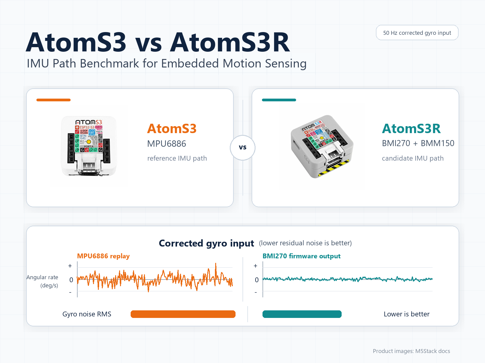
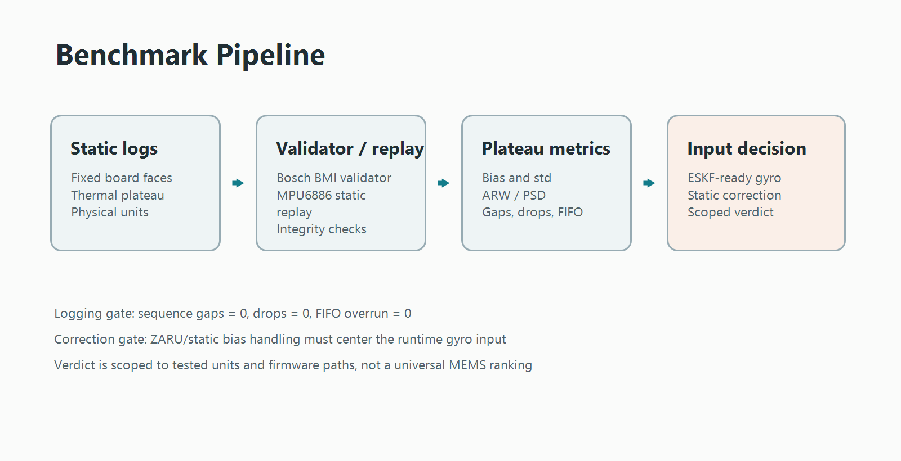
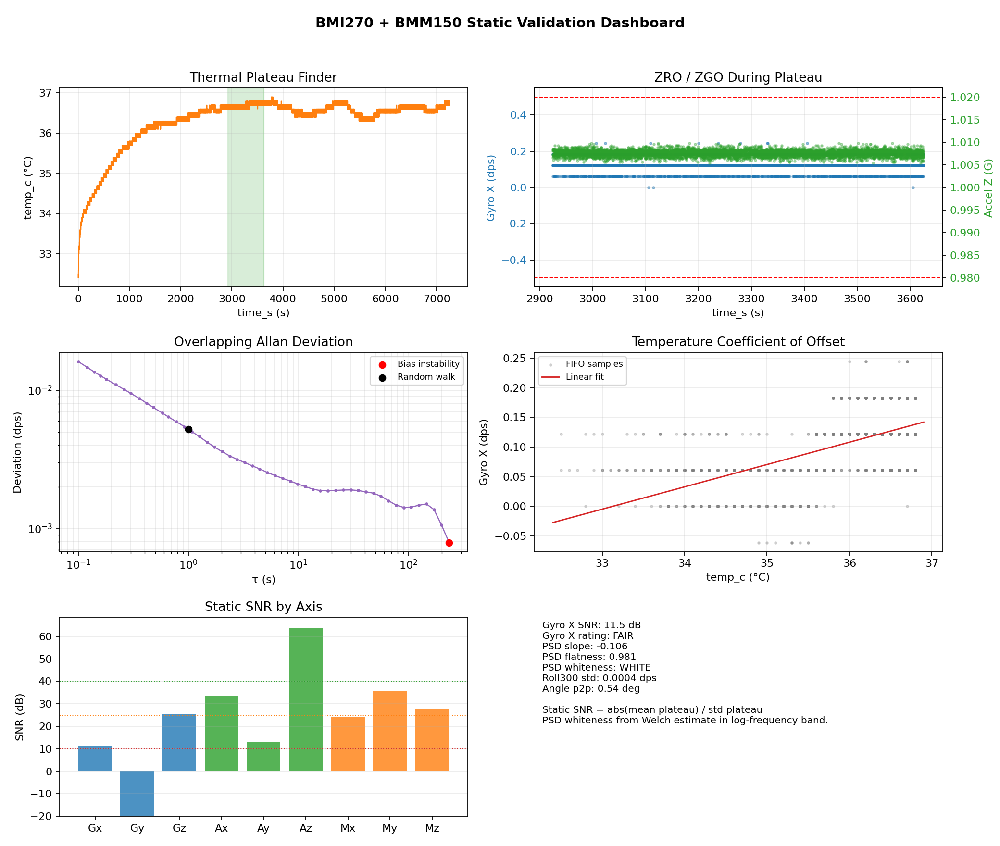
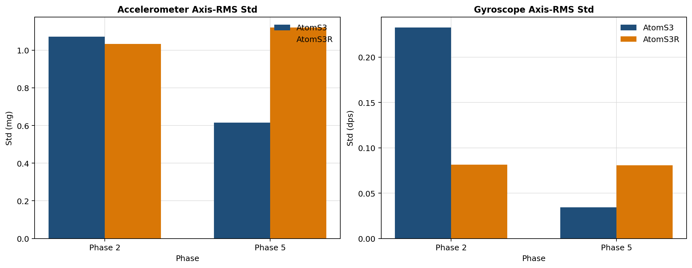
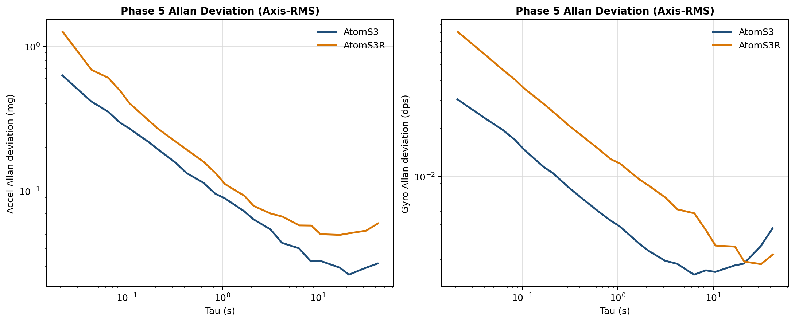

# Static IMU Benchmark: M5Stack AtomS3 vs AtomS3R for Vehicle Sensor Fusion



I compared two M5Stack boards as IMU sources for a vehicle telemetry and
ESKF-style sensor-fusion pipeline:

- **AtomS3** with the **MPU6886**
- **AtomS3R** with the **BMI270 + BMM150**

The question was practical: which board gives the cleaner and more reliable
gyro input after the filtering, logging, and static correction path that I
would actually use in firmware?

This is not a population-level MEMS qualification. It is a single-unit,
firmware-path benchmark. The result is useful to me because it exposes the
failure modes that matter for this estimator, but it should not be read as a
universal claim about every MPU6886 or every BMI270.

## Hardware

| Board | IMU path | Other relevant hardware | Role in this test |
| --- | --- | --- | --- |
| M5Stack AtomS3 | MPU6886 | No magnetometer in this path | Existing/reference IMU path |
| M5Stack AtomS3R | BMI270 + BMM150 | BMM150 magnetometer, PSRAM | Candidate vehicle telemetry path |

The magnetometer is listed because it is part of the AtomS3R hardware, but it is
not part of the IMU verdict below. Static magnetometer behavior depends heavily
on local magnetic conditions, so I kept it separate from the gyro/accelerometer
comparison.

## Method

The benchmark uses long static logs with each board placed in fixed physical
orientations. For each run, the analysis selects a thermally stable plateau
rather than computing statistics over the whole warm-up.

Core method choices:

- Static, long-duration tests on fixed board faces.
- Thermal plateau selection before computing bias, drift, and noise metrics.
- Physical units throughout: gyro in `dps`, acceleration in `g` or `mg`, and
  temperature in `degC`.
- A 50 Hz operating path, because that is the intended estimator input rate.
- Hardware low-pass filtering around 20 Hz: BMI270 ODR50/LPF20-style path and
  MPU6886 DLPF20/ODR50 path.
- Logging integrity checks: sequence gaps, estimated dropped samples, FIFO
  overrun, and SD-write/drop diagnostics.
- No raw GPS data is published.

The 20 Hz LPF detail matters. A raw high-bandwidth signal decimated to 50 Hz is
not the same thing as a signal bandwidth-limited before sampling. For an ESKF
input-quality decision, I care most about the filtered operating path.

## Firmware and analysis pipeline



The two boards were not tested with a single generic sketch. Each path used the
firmware or replay route that best matched the question being asked.

| Component | What it did |
| --- | --- |
| Dedicated MPU6886 static bench firmware | Logged MPU6886 FIFO data to SD with fixed-size records, CRC, sequence numbers, timing checks, and FIFO/SD diagnostics. It does not include GPS, ESKF, ZARU, axis rotation, or a calibration layer. |
| AtomS3R vehicle-format logging path | Logged BMI270 physical columns through the current AtomS3R firmware path used for vehicle telemetry. |
| Bosch/BMI static validator | Checked BMI270 plateau statistics, PSD/whiteness, noise, bias, and logging health. |
| Offline runtime comparison script | Rebuilt the runtime input comparison from private raw CSV/BIN sources into compact public reports. |
| ZARU/static correction concept | During stationarity, the pipeline estimates or suppresses residual gyro bias so the estimator sees a centered gyro input. |

For the BMI270 path, the most important result is measured directly from the
current firmware output. For the MPU6886 path, the corrected result is an
offline static sensor-only replay. That distinction is important: the MPU6886
replay is useful as a bound, but it is not a demonstrated firmware ESKF result.

## Key Results

The clean BMI270 confirmation run was `tel_148`. It matters because earlier
AtomS3R logs had timing gaps in the logging path. In `tel_148`, those issues are
gone while the sensor FIFO remains clean.

| Logging metric | BMI270 `tel_148` |
| --- | ---: |
| Sequence gaps | 0 |
| Estimated dropped samples | 0 |
| FIFO overrun | 0 |



The runtime-input comparison is the core of the decision:

| Sensor / case | Source | Mean residual X/Y/Z (dps) | Std X/Y/Z (dps) | Read |
| --- | --- | ---: | ---: | --- |
| BMI270 `tel_148` | Measured firmware output after pipeline/ZARU | about `0 / 0 / 0 dps` | `0.0068 / 0.0058 / 0.0061 dps` | Clean runtime input |
| MPU6886 fixed-bias replay | `MPU6886_014 -> MPU6886_017` | `+1.293 / +1.829 / +0.001 dps` | `0.056 / 0.041 / 0.032 dps` | Fixed X/Y bias is not adequate in my tested unit |
| MPU6886 oracle/static replay | Same-run plateau bias on `MPU6886_017` | about `0 / 0 / 0 dps` | `0.056 / 0.041 / 0.032 dps` | Best static bound, not firmware ESKF output |

Even under ideal static MPU6886 bias removal, the BMI270 measured runtime input
is about **5-9x quieter** in this benchmark.

The MPU6886 fixed-bias replay is the result that changed my decision. Applying
the `MPU6886_014` +Z bias to the later same-face `MPU6886_017` run leaves a
large X/Y residual:

| MPU6886 same-face DLPF20 repeat | X | Y | Z |
| --- | ---: | ---: | ---: |
| `017 - 014` gyro mean delta | `+1.293 dps` | `+1.829 dps` | `+0.001 dps` |

The accelerometer means were close in that repeat, so the evidence points more
toward startup-bias repeatability than a large pose mistake.

For broader context, these figures from the repository summarize the noise and
Allan-style behavior used in the whitepaper:





## Interpretation

White noise is not the whole story.

After DLPF20, the tested MPU6886 is not simply "noisy." Its Z-axis filtered
noise and stability remain interesting. The blocker for my ESKF-style pipeline
is the X/Y startup-bias repeatability seen in the tested AtomS3 unit and firmware
path. A fixed stored bias from one static run did not transfer well to a later
same-face run.

That matters more than raw sample noise because a static gyro bias integrates
directly into angle error. If the bias changes by more than the runtime
correction path can estimate, the estimator gets a plausible-looking but wrong
angular-rate input.

The AtomS3R/BMI270 path is operationally stronger in this tested setup because:

- the final firmware run has clean logging diagnostics;
- the operating path is already 50 Hz with LPF around 20 Hz;
- ZARU/static correction keeps the final gyro input centered near zero;
- the final corrected gyro standard deviation is around `0.006 dps` per axis.

The MPU6886 may still be recoverable, but for this pipeline it would need robust
per-boot or runtime X/Y bias estimation, followed by dynamic validation. The
offline oracle replay shows that static re-centering is possible; it does not
prove the full firmware path is already solved.

## Practical Decision

For my tested devices and current pipeline, I would choose **AtomS3R/BMI270**.

I am not treating this as a universal MPU6886 verdict, and I am not claiming
that the BMI270 wins every possible sensor benchmark. The MPU6886 remains
interesting on Z-axis stability and filtered noise. In my tested unit and
firmware path, the practical blocker is X/Y startup-bias repeatability. I would
only move the AtomS3/MPU6886 path forward for this ESKF use case after
validating a robust per-boot/runtime bias estimator.

## Limitations

Important limits of this benchmark:

- It is a single-unit comparison, not a population study.
- It is mostly static; a complete vehicle decision still benefits from dynamic
  replay or road testing.
- The MPU6886 corrected result is an offline static sensor-only replay, not a
  firmware ESKF output.
- This is not a population-level MEMS qualification.
- Magnetometer behavior is not part of the IMU verdict.
- Raw GPS/vehicle logs are not published.
- Thermal behavior was observed through plateau selection, but this is not a
  controlled thermal-chamber characterization.

## Reproducibility / GitHub Repo

The repository is organized so readers can inspect the public reports without
needing the private raw logs. The full whitepaper goes deeper than this article,
and the runtime comparison can be regenerated from private raw files with:

```powershell
python .\scripts\build_atom_runtime_comparison.py
```

Start here:

- GitHub repository: [GitHub repo](https://github.com/Niccolo1305/atoms3-imu-benchmark)
- Full technical whitepaper: `docs/AtomS3_vs_AtomS3R_Sensor_Bench_Whitepaper.md`

## Code and Data Availability

The GitHub repo contains the public evidence package: compact reports,
dashboards, figures, scripts, documentation, and the dedicated MPU6886 static
bench firmware.

Raw `.BIN` captures and large raw `.csv` files are excluded for size and
privacy. If the private raw files are placed in
`data/raw_private_NOT_COMMITTED/`, the comparison artifacts can be regenerated
with the script above. No raw GPS/vehicle logs are published.

## Conclusion

For this single-unit static benchmark and my current ESKF-style vehicle
telemetry path, AtomS3R/BMI270 is the more practical IMU choice. This is not a
blanket sensor ranking; the tested AtomS3/MPU6886 path would need stronger
runtime X/Y bias recovery before I would trust it as the estimator input. The
BMI270 path already produced a clean logged runtime gyro input after LPF and
ZARU/static correction.
